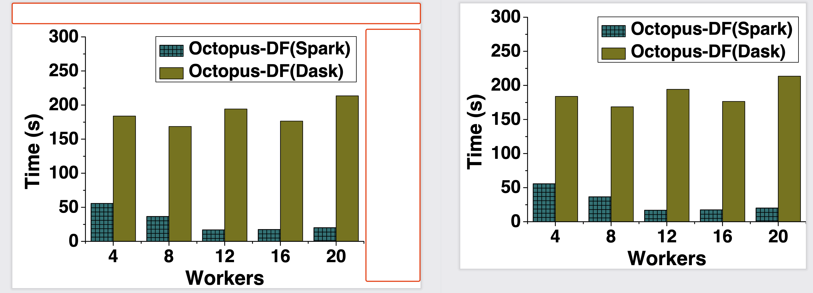

# pdf-cut-white

在使用 LaTeX 书写论文时（或其他场景），常常需要花费大量时间处理 PDF 图表——`裁剪不必要的图表白边`。所幸就写个自动化工具吧——精准高效地完成此任务。

When writing papers with LaTeX (or in other scenarios), significant time is often spent processing PDF figures and tables—`trimming unnecessary white margins`. To address this, I developed this automated tool designed to perform the task accurately and efficiently.

# 提示
**本文档虽简短，但内容重要，请务必完整阅读。**

更新后，请重新安装依赖以确保内容一致：`pip3 install -r requirements.txt`。

> For English version, please refer to [here](#mention)。



# 特性
本工具可自动裁剪生成的 PDF 图表中的白边（效果如上图所示），减少人工干预及对其他软件（如 Adobe Acrobat）的依赖。

# 使用

请安装 Python 3.8 或更高版本，具体安装方法详见[Install](#install)章节。

建议优先使用命令行版本，详细信息见[CLI](#cli)章节。

CLI 工作流程说明：
- 读取原始 PDF 文件的每一页（实际仅处理第一页，因默认每个 PDF 为单页图表）
- 基于 PDF 元素分析识别页面中的白边
- 裁剪白边（本质是通过缩减 MediaBox 实现）
- 输出去除白边的新 PDF 文件

如需使用图形界面版本，请确保能成功安装 PySide6，详情见[GUI](#gui)章节。

GUI 工作流程说明：
- 启动工具，选择输入与输出文件夹（必须使用不同文件夹以防源文件被覆盖）
- 扫描 PDF 文件（GUI 支持在列表中二次选择特定 PDF 文件）（注意：仅扫描一级目录，不递归扫描子目录）
- 确认无误后，点击完成 PDF 裁剪（仅处理选中文件），结果输出至指定文件夹

## 注意事项
部分 PDF 输出可能在外围包含 RT 元素，导致无法正常裁剪。此时可尝试添加 `--ignore 1` 参数。

建议优先不使用 `ignore` 参数进行尝试，若出现问题再启用该参数，并进行人工核查。此类情况相对较少，主要取决于原始绘图工具。

> 如遇任何问题，请先查阅现有 `issue`，若仍无法解决，请提交新 `issue`（请附带 `--verbose` 执行日志）。若条件允许，请提供问题案例文件（case.pdf）。

# 其他

已知限制：

- 仅扫描一级目录，不支持递归扫描。
  - 可有效避免误操作导致的大规模文件 I/O。
  - 工具已实现自动化，以一级目录为单位处理已足够满足需求。
  - 出于安全考虑，禁止对同一目录或同名文件进行操作。
- 对于原始 PDF 文件可妥善完成裁剪，但若 PDF 曾被其他工具编辑过（特别是裁剪过），再次裁剪可能产生错误输出。
  - 因本工具通过修正 PDF 的 MediaBox 实现裁剪，可能与其他工具的处理方式不兼容。
- 偶尔可能出现裁剪过度精细的情况，正在优化中。
  - 本质上，白边指无内容区域，工具会统计所有有意义元素（如文本框、图像等）并计算最大有效坐标范围，该范围外的部分即视为白边。
- 部分元素尚未完全处理
  - 可参考 `pdf_white_cut/worker.py::extract_pdf_boxs`，部分元素使用了原始边界框（bbox），可能导致保留的白边过多。如有此类问题，请提交 issue 并附带测试用例和日志。


# Mention

Please reinstall dependencies after updates to ensure consistency: `pip3 install -r requirements.txt` (refer to [changelog](#Changelog) for details).

# Feature

Automatically removes unnecessary white margins from PDFs. The input PDF should be a single-page figure or table.

# Usage

## Install

- Install Python 3 (version 3.8 or above)
- Install dependencies: `pip3 install -r requirements.txt` or `pip3 install -r requirements.txt --user`

## CLI

Recommended to use the command-line interface:

```sh
# Cut single PDF
python cli.py -i in.pdf -o out.pdf

# Process all PDFs in a folder
python cli.py -id infolder -od outfolder
```

> Note: Add `--ignore 1` parameter if the output is not as expected.

## GUI

Ensure GUI is truly needed:

```sh
# Install PySide6, the official Qt for Python
pip install PySide6==6.8.1

# If installation succeeds, run
python gui.py
```


# Misc

## Limitation

Known limitations:

- Only scans top-level directory (no recursion)
- May fail for PDFs previously edited by other tools (TODO: implement proper handling)
- Primarily supports single-page PDFs; multi-page support may be limited (please test first)
- May fail in cases with excessive white space (TODO: implement proper handling)
  - See `pdf_white_cut/worker.py::extract_pdf_boxs`

## Changelog

- (bugfix & feat) Added support for rotated PDF pages
- (refactor) Reduced number of files and function definitions
- (dependency) Upgraded to PySide6 for GUI with QT
- (dependency) Switched to `pdfminer.six` (community-maintained fork, as original `pdfminer` is no longer actively maintained)
- (bugfix) Added missing `LTFigure` analysis
- (bugfix) Fixed path processing error in `batch_cut_pdf`
- (bugfix) Added missing `LTTextBox` or `LTTextLine` analysis
- (feature) Implemented GUI based on PySide2 (official)
- (bugfix) Fixed issues with previously edited PDFs (addressed pdfminer's relative position handling)
- (feature) Implemented CLI using argparse

## Dependency

- PyMuPDF: Used as `fitz`, excels at PDF I/O operations
- pypdf: Pure Python library for PDF processing (successor to PyPDF2)
- pdfminer.six: Community-maintained fork for scanning PDF elements
- PySide6: Optional, required only for GUI functionality
- loguru: Logging library
